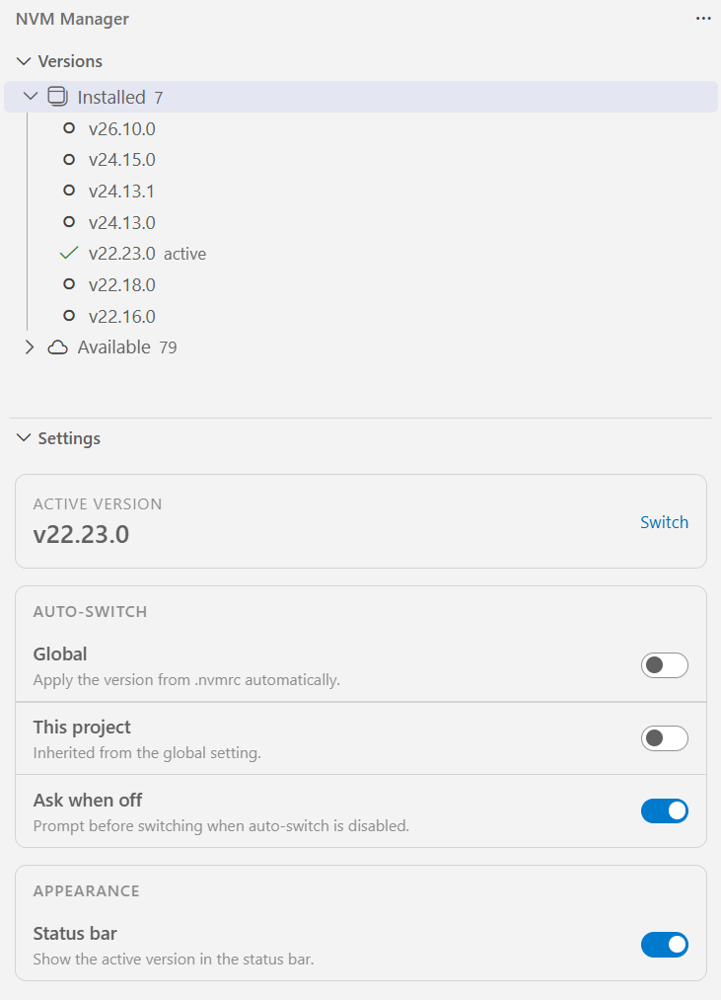

# NVM Manager

A VS Code extension for **nvm-windows** and **nvm (nvm-sh)**: see every installed Node.js
version, switch the active one, and let a project pin its version through `.nvmrc` — all without
leaving the editor.

> On Windows the switch repoints the global nvm symlink. On macOS/Linux `nvm use` only affects
> its own shell, so the selected version is applied to the **integrated terminals** instead.

<p align="center">
  
</p>

## Features

- **Versions view** in the activity bar: installed versions with the active one marked, plus an
  **Available** list (`nvm list available` / `nvm ls-remote`) you can install from.
- **Switch in one click** from the tree, the status bar, or the command palette
  (`NVM: Switch Node.js Version...`).
- **Active version in the status bar** — click it to switch.
- **Auto-switch per project**: reads `.nvmrc`, then `.node-version`, then `package.json`
  `engines.node`, resolves it against the installed list (`22`, `v22.16.0`, `22.16`, `lts/*`,
  `node`) and switches.
- **Global and per-project toggles** in the sidebar **Settings** panel:
  - global auto-switch,
  - project override (inherits the global value until you change it),
  - "ask when off" — prompt before switching when auto-switch is disabled,
  - status bar visibility.
- **Manage versions**: install, uninstall and copy a version from the context menu.

## Requirements

- **Windows**: [nvm-windows](https://github.com/coreybutler/nvm-windows) installed and `nvm`
  available. Auto-detects `nvm.exe` from `NVM_HOME`, then `PATH`, or set `nvmManager.nvmPath`.
- **macOS / Linux**: [nvm-sh](https://github.com/nvm-sh/nvm) installed. Auto-detects `NVM_DIR`
  or `~/.nvm`, or set `nvmManager.nvmDir`. Switching applies to VS Code's integrated terminals.

## Installation

- From the Marketplace: search for **NVM Manager** (publisher **Jenesei Software**).
- Or install a local build: **Extensions** view → `...` → **Install from VSIX...**.

## Getting started

1. Open the **NVM Manager** icon in the activity bar.
2. The **Versions** view lists what is installed; the active version has a green check.
3. Click a version (or the status bar item) to switch. On macOS/Linux, open a **new** integrated
   terminal to pick up the change.
4. Open **Settings** in the same container to configure auto-switch.

To pin a project version, add `.nvmrc` at the repository root:

```
22.16.0
```

## Settings

| Setting | Default | Scope | Description |
| --- | --- | --- | --- |
| `nvmManager.autoSwitch` | `false` | resource | Auto-switch the active version from `.nvmrc` / `.node-version` / `package.json`. Set globally or per workspace. |
| `nvmManager.askWhenAutoSwitchOff` | `true` | window | Ask before switching when auto-switch is disabled. |
| `nvmManager.statusBar.enabled` | `true` | window | Show the active version in the status bar. |
| `nvmManager.nvmPath` | `""` | machine-overridable | Windows only. Absolute path to `nvm.exe`. Empty means auto-detect. |
| `nvmManager.nvmDir` | `""` | machine-overridable | macOS / Linux only. Path to `NVM_DIR`. Empty means auto-detect. |

When auto-switch is on, opening a workspace silently switches to the pinned version. When it is
off and **Ask when off** is on, a notification offers **Switch** and **Always for this project**.

## Commands

| Command | Description |
| --- | --- |
| `NVM: Refresh` | Reload the installed list and the active version. |
| `NVM: Switch Node.js Version...` | Pick a version from a quick pick. |
| `NVM: Refresh Available Versions` | Reload `nvm list available`. |
| `NVM: Toggle Auto-switch (Global)` | Flip the global auto-switch setting. |
| `NVM: Toggle Auto-switch (This Project)` | Flip the project override. |
| `NVM: Open Settings` | Focus the Settings panel. |

## Support the project

NVM Manager is free and open source. If it is useful to you:

- ⭐ **Star the repository** — it helps other people find it.
- ☕ **[DonationAlerts](https://www.donationalerts.com/r/cyrilstrone)** — a one-time donation keeps the project alive.

## Development

Requirements: Node.js 22+ and npm.

```powershell
npm install
npm run build         # dev bundle to dist/ (with source maps)
npm run build:watch   # rebuild on change
npm run build:prod    # minified production bundle
npm run lint          # biome check (lint + format + imports)
npm run lint:fix      # biome check, apply safe fixes
npm run format        # biome format --write
npm run typecheck     # tsc --noEmit
npm run check         # lint + typecheck
npm test              # unit tests for the version resolver
npm run vsix          # package the .vsix
```

Press `F5` in VS Code to launch an Extension Development Host.

### Run the extension locally

1. Install dependencies and build the bundle:

   ```powershell
   npm install
   npm run build
   ```

2. Open this folder in VS Code and press `F5` (Run and Debug → **Run Extension**).
   A second window opens with the extension loaded — open the **NVM Manager** icon in the
   activity bar there. Use `npm run build:watch` in a terminal to rebuild on every change.

To try it in your normal editor without the debug host, package it and install the `.vsix`:

```powershell
npm run vsix
code --install-extension nvm-manager-0.0.1.vsix
```

The version in the file name comes from `package.json`.

## License

Released under the [MIT License](LICENSE).
